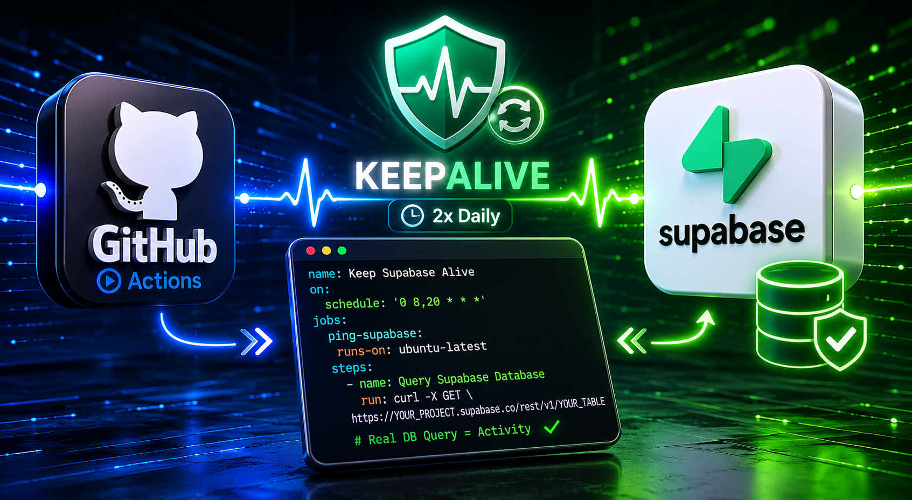

# 🟢 Keep Supabase Alive: מניעת השהיית פרויקטים

<p align="center">
  
  
</p>

<p align="center">
  
</p>

פתרון אוטומטי למניעת השהייה (Pause) של פרויקטים חינמיים ב-Supabase עקב חוסר פעילות, על ידי יצירת פעילות יזומה ואוטומטית במסד הנתונים באמצעות GitHub Actions.

---

# 🎯 הבעיה

- **מדיניות המסלול החינמי:**  
  ב-Supabase, פרויקט שלא נרשמת בו פעילות מסד נתונים במשך 7 ימים ברצף – מושהה אוטומטית.

- **האתגר בפרויקטים אישיים:**  
  פרויקטים קטנים (כמו כלי עזר או אפליקציות לשימוש אישי כגון חישובי הוצאות חשמל ומים שבודקים פעם בחודש) סובלים מכך במיוחד.

- **האתגר הטכני:**  
  Ping רגיל לשרת לא מספיק.  
  Supabase דורש שאילתת Database אמיתית כדי לאפס את הטיימר.

---

# 💡 הפתרון

הקמת אוטומציה ב-GitHub שרצה פעמיים ביום, ניגשת ל-API של הפרויקט, ומבצעת שאילתת Select קטנה ואמיתית לטבלה במסד הנתונים.

## הסקריפט כולל מנגנוני הגנה מתקדמים

- ✅ פעילות Database אמיתית
- ✅ הגנה מקריסות רשת רגעיות
- ✅ מניעת כיבוי של GitHub Actions
- ✅ הרצה אוטומטית פעמיים ביום
- ✅ אפשרות להרצה ידנית

---

# ⚙️ הוראות התקנה והגדרה

## שלב 1: השגת פרטי ההתחברות מ-Supabase

1. היכנסו ל-Supabase
2. בחרו את הפרויקט שלכם
3. בתפריט הצד:
   - **Settings**
   - **API**

העתיקו:

- `Project ID`
- `anon public key`

---

## שלב 2: הגדרת Secrets ב-GitHub

1. Repository → **Settings**
2. **Secrets and variables**
3. **Actions**
4. **New repository secret**

הוסיפו:

### Secret ראשון

```txt
Name: SUPABASE_PROJECT_ID
Value: YOUR_PROJECT_ID
```

### Secret שני

```txt
Name: SUPABASE_ANON_KEY
Value: YOUR_SUPABASE_ANON_KEY
```

---

# שלב 3: הוספת האוטומציה

> ⚠️ חשוב: לפני הרצת הסקריפט, החליפו את `your_table_name` בשם של טבלה אמיתית וציבורית בפרויקט שלכם.

צרו קובץ:

```txt
.github/workflows/keep-supabase-alive.yml
```

והדביקו:

```yaml
name: Keep Supabase Alive

on:
  schedule:
    # Runs twice a day at 08:00 and 20:00 UTC
    - cron: '0 8,20 * * *'

  # Allows manual execution
  workflow_dispatch:

jobs:
  ping-supabase:
    runs-on: ubuntu-latest
    name: Ping Supabase Project

    permissions:
      contents: write

    steps:
      - name: Checkout repository
        uses: actions/checkout@v5
        with:
          fetch-depth: 1

      - name: Query Supabase Database
        continue-on-error: true

        env:
          SUPABASE_PROJECT_ID: ${{ secrets.SUPABASE_PROJECT_ID }}
          SUPABASE_ANON_KEY: ${{ secrets.SUPABASE_ANON_KEY }}

        run: |
          # Real DB query against a public table
          # 👇 Replace with a real table name
          URL="https://${SUPABASE_PROJECT_ID}.supabase.co/rest/v1/your_table_name?select=id&limit=1"

          echo "Querying Supabase DB: $SUPABASE_PROJECT_ID..."

          HTTP_CODE=$(curl -s -o /tmp/resp.json -w "%{http_code}" -X GET "$URL" \
            -H "apikey: $SUPABASE_ANON_KEY" \
            -H "Authorization: Bearer $SUPABASE_ANON_KEY" \
            -H "Accept: application/json" \
            --max-time 15)

          echo "HTTP status: $HTTP_CODE"
          echo "Response body:"
          cat /tmp/resp.json || true
          echo ""

          if [ "$HTTP_CODE" = "200" ]; then
            echo "✅ Real DB query succeeded — activity registered."
          else
            echo "⚠️ Unexpected status code: $HTTP_CODE"
            exit 1
          fi

      - name: Keep workflow alive
        run: |
          # Check if last commit is older than 30 days
          LAST_COMMIT=$(git log -1 --format=%ct)
          NOW=$(date +%s)
          DAYS_AGO=$(( (NOW - LAST_COMMIT) / 86400 ))

          if [ "$DAYS_AGO" -ge 30 ]; then
            echo "No commits for $DAYS_AGO days, pushing keepalive commit..."

            git config user.name "github-actions[bot]"
            git config user.email "github-actions[bot]@users.noreply.github.com"

            git commit --allow-empty -m "chore: keep workflow alive"
            git push
          else
            echo "Last commit was $DAYS_AGO days ago, no keepalive needed."
          fi
```

---

# 🛠️ דגשים לעבודה השוטפת

## שגר ושכח

מרגע הכנסת הקובץ ל-GitHub, האוטומציה תרוץ לבד ברקע.

---

## בדיקה ידנית

ניתן להיכנס לטאב:

```txt
Actions
```

ולהריץ ידנית את:

```txt
Keep Supabase Alive
```

כדי לוודא שהכול עובד.

---

## הרשאות RLS

ודאו שהטבלה שבחרתם מאפשרת פעולת Select.

---

# ❗ תקלות נפוצות

## 401 / 403

בדקו שה־Secrets הוגדרו נכון:

```txt
SUPABASE_PROJECT_ID
SUPABASE_ANON_KEY
```

---

## 404 Not Found

כנראה שעדיין מופיע:

```txt
your_table_name
```

החליפו אותו בשם טבלה אמיתי.

---

## Workflow לא רץ

ייתכן שצריך לאשר GitHub Actions בפעם הראשונה דרך טאב:

```txt
Actions
```

---

# 🔐 אבטחה

לעולם אל תכניסו את מפתחות Supabase ישירות לקוד או ל־README.

השתמשו תמיד ב־GitHub Secrets.

---

# ✅ סיימתם

מעכשיו הפרויקט שלכם ב-Supabase יישאר פעיל וזמין אוטומטית 🚀
